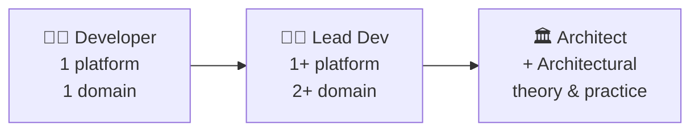

# Architecture
## Introduction

::image::

---
layout: agenda
size: lg
items:
  - Architect?
  - Architecture?
  - Design!
---

<!--
Design & Dependency Management: The bread & butter of an architect.
-->

---
layout: section
---

# Architect?

---
layout: statement
---

# Architect: What?

A software architect is a **software expert** who makes **high-level design** choices and dictates technical standards, including software coding standards, tools, and platforms.

::image::

<!--
**Software expert**: Platform (.NET/Java), ecosystem but also security, performance (interview question: SQL Index – execution plans, table scan/index seek, tradeoffs), … GC issue  ask the architect for advice, UnitTesting, …

**High Level Design**: many of the sessions will be about this part
-->

---
layout: default-aside
h1:
  type: braces
  color: primary
  position: 2
---

# Architect: How?

::image::

<!--
Becoming an architect is a **logical evolution** for a developer. As he gains more knowledge & experience, a developer evolves to a role as « Lead Dev » and then into that of « architect ». If the developer **wants** this: some want to stay in the developer role: « give me a story for me to implement and not too many time-wasting meetings please »

A lead dev could already be considered an architect. A developer may setup a pet solo project – he is the architect!

The lines are **muddy**: a developer within the team could already be functioning as its architect. On some projects the architect is basically a developer.

Every team should have an architect (even if it's just one of the developers) to avoid a kakafonie of architecture-styles within the same system.

This grows organically within a team: typically the most senior and/or knowledgeable person takes up the role  if there is no dedicated architect. Or it could be the loudest developer or it could be the best communicator.
-->

---
layout: default-aside
---

# Architect: Kinds?

::image::

<!--
**Lead Dev & App Architect**: Some additional meetings with other developers (about design, production issues, deployment issues), meetings with PO/PM about feasability and high level estimates, …

**Solution Architect**: Meetings with other teams for integrations. Infrastructure, … Must let go of the low-level details of the code.

**Enterprise Architect**: Meetings with stakeholders, solution architects, business
-->

---
layout: default-aside
textSize: sm
h1:
  type: hash
  color: muted
  position: start
---

# Architect: Kinds

<v-clicks depth="2">

- Application / System Architect
  - 1 system
  - Deep knowledge of technologies
  - Help PO / PM make management decisions
- Solution Architect
  - Connect / Integrate multiple systems
  - Discussions with business & other teams
  - Code prototypes
- Enterprise Architect
  - Affects development company wide
  - Rarely, if ever, codes
- Other (Infrastructure & Domain)

</v-clicks>

::image::

<!--
**Application Architect**: Focus on technical components

**Solution Architect**:

**Enterprise Architect**: Very very high level, technical communication company-wide, broad technological horizon, focus on business components

**Infrastructure Architect**: Network Architect, Server Architect

**Domain Architect**: Do not go there. .NET / Java Architect. Mobile Architect (Android, iOS), Cloud Architect (AWS)   ALSO   Data Architect, Security Architect, Integration Architect
-->

---
layout: default-aside
textSize: xl
---

# Application Architect

<v-clicks>

- Communication
- Broad & Deep Technical Knowledge
- Responsibility
- Analytical Skills
- Management Skills

</v-clicks>

::image::

<!--
A mix of soft & hard skills

**Communication**: with customers  Language of business   ||     managers, analysts  high level communication    ||      developers  technical communication

**Broad & Deep Technical Knowledge**: If all you have is a hammer, everything looks like a nail  Learn multiple languages, platforms etc

**Responsibility**: A developer mistake can usually be solved in days. A grave architectural problem might take months or even years to right. + If there is an issue with « your » application, stakeholders will turn at the architect. No matter who is responsible, it's the architect that is responsible: « I made this mistake » vs « We made this milestone »  Bad=you, Good=us

**Analytical Skills:** Represent an abstract problem into something that can be communicated with different stakeholders: management (we can make this, like this) and developers (how we will make it)

**Management Skills**: Lead a team of developers. Conflict situations: tabs vs spaces, …
-->

---
layout: default-aside
h1:
  type: dot
  color: primary
  position: end
size: sm
---

# Architect: Tasks

<v-clicks depth="2">

- Identify Stakeholders & Requirements
  - Business & Non Functional Requirements
- Designing the System
  - High level system component architecture
  - Selection of technologies
- Code-Reviews
- Writing (& maintaining!) project documentation
- Uniform development standards
- Architectural evolution

</v-clicks>

::image::

<!--
Tasks could be for Application Architect only or for Enterprise Architect only – depending on the company.

**Business requirements**: what does it actually have to do

**Other requirements**: itilities

**Evolution**: The architecture should not be static, it grows and changes as the development team gets to know the domain and its users better and/or as requirements and priorities change. The Pragmatic Programmers compare Architecture not with a building blueprint but with growing & maintaining a garden.
-->

---
layout: statement
---

# Questions?

---
layout: section
---

# Architecture?

::subtitle::

Architecture is design on a higher level

<!--
Haha! This track is not about architecture, but about software design!
-->

---
layout: statement
---

# Architecture: What?

Good architecture makes it easy to do the right thing and hard to do the wrong thing

Within all constraints and requirements, do the simplest thing and grow the architecture with the code

::image::

---
layout: default-aside
h1:
  type: brackets
  color: muted
  position: all
size: sm
---

# Non Functional Requirements

<v-clicks>

- Maintainability
- Configurability
- Extensibility
- Debuggability
- Testability
- Scalability
- Usability & Accessibility
- Vulnerability
- Upgradability

</v-clicks>

::image::

---
layout: section
---

# Design!

---
layout: default-aside
h1:
  type: slashes
  color: primary
  position: end
---

# Architecture: Pitfalls

<v-clicks>

- No Design
- Enterprise Framework
- Technical Architecture (ex: CQRS)
- Overengineering

</v-clicks>

::image::

<!--
**No Design**: Ok for small and one-time things (migrations, scripts, …) For larger applications: after a while, making the same small change takes more and more development time and a greater chance for incomplete implementations.

**Enterprise Framework**: The dreaded enterprise framework, developed by the Ivory Tower Architect Team. This can be a really good thing but, unfortunately, it is usually a pretty bad thing. How it could work: HarvestedFramework

**Technical Architecture**: CQRS
-->

---
layout: default-aside
textSize: xl
---

# Small Frameworks

## Single purpose frameworks for recurring UserStories

<v-clicks depth="2">

- Rule Of Three aka 1,2,Infinite
- Design Patterns
  - Communication
  - Consequences!

</v-clicks>

::image::

---
layout: default-aside
h1:
  type: braces
  color: muted
  position: 1-2
h2:
  type: dot
  color: primary
  position: end
---

# Brown Field Development

## Applications without architecture or a bad fit

<v-clicks>

- Don't Rebuild
- Avoid big refactorings
- Avoid multiple architectures
- Introduce Seams & UnitTesting
- Introduce Design
- Or… Strangle Applications

</v-clicks>

::image::

---
layout: statement
---

# Questions?

---
layout: default
size: xs
---

# Sessions

<v-clicks depth="2">

- Uniform development standards
- Architectures (n-tier, event driven, microservices, …)
  - Explore how an Enterprise Framework could work
- Design
  - Introductory Session
  - Real world use case (your project?)
  - Small Frameworks
- Brown Field Development & UnitTesting
- Communication (Persuasion, Compromising, …)
- Non Functionals (Security, Maintainability, …)
  - Performance (Db, Profilers, …)
- UML & ERD
- Dependency Management & Dependency Inversion

</v-clicks>

<!--
**Uniform development standards**:
Some acronyms (DRY, YAGNI, …)
Development standards enforcement (.editorconfig, linting, UnitTesting on CI, compiler warnings, gitignore/comments/…, …)
Low level coding guidelines (comments, tabs vs spaces, function length vs bugs correlations, …)

**Architectures**: n-tier, hex, onion, CQRS, event sourcing, microservices, serverless, microkernel aka plugin, space based aka cloud architecture
-->

---
layout: default
---

# Next Steps

<v-clicks>

- Prioritize & Plan the next sessions
- Setup second meeting « opleidingsplan »

</v-clicks>

---
layout: socials
---

---
layout: source
source: itenium-be/Architecture-KickOff
---

---
layout: end
---
