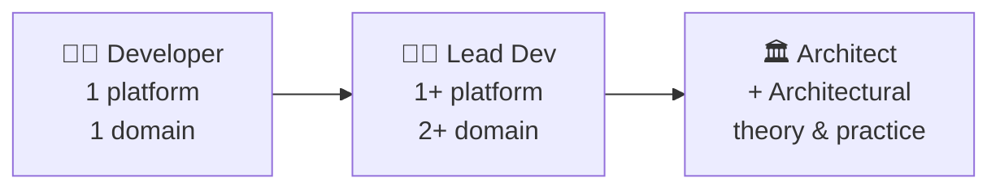
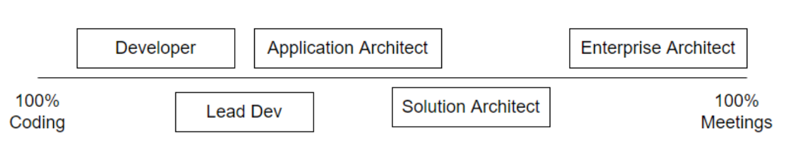
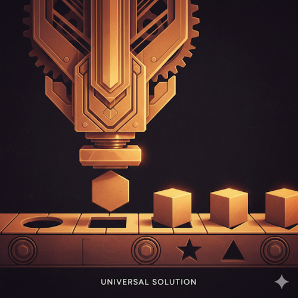
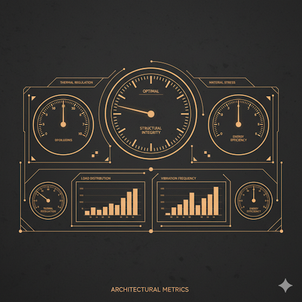

# Architecture
## Introduction

::image::

---
layout: agenda
size: lg
items:
  - Architect?
  - Architecture?
  - Design!
  - Thinking Like an Architect
---

<!--
Design & Dependency Management: The bread & butter of an architect.
-->

---
layout: section
---

# Architect?

---
layout: statement
---

# Architect: What?

A software architect is a **software expert** who makes **high-level design** choices and dictates technical standards, including software coding standards, tools, and platforms.

::image::

<!--
**Software expert**: Platform (.NET/Java), ecosystem but also security, performance (interview question: SQL Index – execution plans, table scan/index seek, tradeoffs), … GC issue  ask the architect for advice, UnitTesting, …

**High Level Design**: many of the sessions will be about this part
-->

---
layout: default-aside
h1:
  type: braces
  color: primary
  position: 2
---

# Architect: How?

::image::

<!--
Becoming an architect is a **logical evolution** for a developer. As he gains more knowledge & experience, a developer evolves to a role as « Lead Dev » and then into that of « architect ». If the developer **wants** this: some want to stay in the developer role: « give me a story for me to implement and not too many time-wasting meetings please »

A lead dev could already be considered an architect. A developer may setup a pet solo project – he is the architect!

The lines are **muddy**: a developer within the team could already be functioning as its architect. On some projects the architect is basically a developer.

Every team should have an architect (even if it's just one of the developers) to avoid a kakafonie of architecture-styles within the same system.

This grows organically within a team: typically the most senior and/or knowledgeable person takes up the role  if there is no dedicated architect. Or it could be the loudest developer or it could be the best communicator.
-->

---
layout: default-aside
---

# Architect: Kinds?

::image::

<!--
**Lead Dev & App Architect**: Some additional meetings with other developers (about design, production issues, deployment issues), meetings with PO/PM about feasability and high level estimates, …

**Solution Architect**: Meetings with other teams for integrations. Infrastructure, … Must let go of the low-level details of the code.

**Enterprise Architect**: Meetings with stakeholders, solution architects, business
-->

---
layout: default-aside
textSize: sm
h1:
  type: hash
  color: muted
  position: start
---

# Architect: Kinds

<v-clicks depth="2">

- Application / System Architect
  - 1 system
  - Deep knowledge of technologies
  - Help PO / PM make management decisions
- Solution Architect
  - Connect / Integrate multiple systems
  - Discussions with business & other teams
  - Code prototypes
- Enterprise Architect
  - Affects development company wide
  - Rarely, if ever, codes
- Other (Infrastructure & Domain)

</v-clicks>

::image::

<!--
**Application Architect**: Focus on technical components

**Solution Architect**:

**Enterprise Architect**: Very very high level, technical communication company-wide, broad technological horizon, focus on business components

**Infrastructure Architect**: Network Architect, Server Architect

**Domain Architect**: Do not go there. .NET / Java Architect. Mobile Architect (Android, iOS), Cloud Architect (AWS)   ALSO   Data Architect, Security Architect, Integration Architect
-->

---
layout: default-aside
textSize: xl
---

# Application Architect

<v-clicks>

- Communication
- Broad & Deep Technical Knowledge
- Responsibility
- Analytical Skills
- Management Skills

</v-clicks>

::image::

<!--
A mix of soft & hard skills

**Communication**: with customers  Language of business   ||     managers, analysts  high level communication    ||      developers  technical communication

**Broad & Deep Technical Knowledge**: If all you have is a hammer, everything looks like a nail  Learn multiple languages, platforms etc

**Responsibility**: A developer mistake can usually be solved in days. A grave architectural problem might take months or even years to right. + If there is an issue with « your » application, stakeholders will turn at the architect. No matter who is responsible, it's the architect that is responsible: « I made this mistake » vs « We made this milestone »  Bad=you, Good=us

**Analytical Skills:** Represent an abstract problem into something that can be communicated with different stakeholders: management (we can make this, like this) and developers (how we will make it)

**Management Skills**: Lead a team of developers. Conflict situations: tabs vs spaces, …
-->

---
layout: default-aside
h1:
  type: dot
  color: primary
  position: end
size: sm
---

# Architect: Tasks

<v-clicks depth="2">

- Identify Stakeholders & Requirements
  - Business & Non Functional Requirements
- Designing the System
  - High level system component architecture
  - Selection of technologies
- Code-Reviews
- Writing (& maintaining!) project documentation
- Uniform development standards
- Architectural evolution

</v-clicks>

::image::

<!--
Tasks could be for Application Architect only or for Enterprise Architect only – depending on the company.

**Business requirements**: what does it actually have to do

**Other requirements**: itilities

**Evolution**: The architecture should not be static, it grows and changes as the development team gets to know the domain and its users better and/or as requirements and priorities change. The Pragmatic Programmers compare Architecture not with a building blueprint but with growing & maintaining a garden.
-->

---
layout: statement
---

# Questions?

---
layout: section
---

# Architecture?

::subtitle::

Architecture is design on a higher level

<!--
Haha! This track is not about architecture, but about software design!
-->

---
layout: statement
---

# Architecture: What?

Good architecture makes it easy to do the right thing and hard to do the wrong thing

Within all constraints and requirements, do the simplest thing and grow the architecture with the code

::image::

---
layout: default-aside
h1:
  type: brackets
  color: muted
  position: all
size: sm
---

# Non Functional Requirements

<v-clicks>

- Maintainability
- Configurability
- Extensibility
- Debuggability
- Testability
- Scalability
- Usability & Accessibility
- Vulnerability
- Upgradability

</v-clicks>

::image::

---
layout: default-aside
h1:
  type: dot
  color: muted
  position: end
---

# NFRs Drive Architecture

<v-clicks>

- Need **scalability**? → Stateless services, horizontal scaling
- Need **maintainability**? → Modular boundaries, clear interfaces
- Need **debuggability**? → Observability, structured logging

</v-clicks>

You can't maximize all of them   they trade off against each other

::image::

<!--
NFRs aren't a checklist you tick off at the end. They're the reason you pick one architecture over another. The specific NFRs of your project determine which architectural style fits.

A system that needs extreme scalability looks very different from one that needs extreme auditability. Picking an architecture without knowing your NFRs is like picking a route without knowing your destination.
-->

---
layout: statement
---

# Good Enough Architecture

Match your investment to the project's lifespan and stakes

A 3-month data migration doesn't need hexagonal architecture — a 10-year core system does

::image::

<!--
The danger runs in both directions. Under-architecting a long-lived system means death by a thousand cuts as changes get harder. Over-architecting a throwaway means wasted weeks on structure nobody will maintain.

Ask: "How long will this system live? How many people will work on it? How often will it change?" The answers determine how much architecture you need.
-->

---
layout: section
---

# Design!

---
layout: statement
---

# Coupling & Cohesion

<v-clicks>

**High cohesion**: things that change together live together

**Low coupling**: things that change independently don't depend on each other

Every design decision can be evaluated through this lens

</v-clicks>

::image::

<!--
These are the two metrics that matter most in software design. If you remember nothing else from this talk, remember these two.

High cohesion means a module does one thing well and contains everything it needs. Low coupling means changing one module doesn't force changes in others.

When you're unsure about a design decision, ask: "Does this increase cohesion? Does this reduce coupling?" If yes to both, it's almost certainly the right call.
-->

---
layout: default-aside
textSize: lg
---

# SOLID at a Glance

<v-clicks>

- **S**ingle Responsibility → cohesion
- **O**pen/Closed → coupling
- **L**iskov Substitution → contracts
- **I**nterface Segregation → coupling
- **D**ependency Inversion → coupling

</v-clicks>

Not dogma but a set of tools to achieve low coupling and high cohesion.
 If applying a principle does not improve either, something is wrong.

::image::

<!--
**The key insight**: 4 out of 5 SOLID principles are about managing coupling. The remaining one (SRP) is about cohesion. SOLID is just a structured way to think about the coupling & cohesion lens we just discussed.
-->

---
layout: default-aside
h1:
  type: semicolon
  color: muted
  position: end
---

# KISS / YAGNI / DRY

## SOLID tells you how to *structure* code. These tell you when to *stop*

<v-clicks depth="2">

- **KISS** — Do the simplest thing that could possibly work
  - Especially if you're not sure what to do yet
- **YAGNI** — Do we actually need this?
  - Speculative generality is the enemy
- **DRY** — But not too DRY
  - Ten similar lines beat a premature abstraction

</v-clicks>

Decision-making heuristics that prevent over-applying SOLID

::image::

<!--
Without them, you get the "astronaut architect" who builds perfect abstractions for problems that don't exist.

**Speculative generality is the enemy**: abstraction for a future requirement that never arrives is pure waste.  
The interface you extract because two real consumers need it today? That's just design.

The DRY nuance is important: the Rule of Three applies here. Don't abstract after seeing duplication once. Wait until you've seen it three times — by then you understand the actual pattern, not just the surface similarity.
-->

---
layout: default-aside
size: sm
---

# Cargo Cult Architecture

## Following the form without the purpose

<v-clicks>

- Identical classes mapped through 4 layers "in case they diverge"
- Abstractions with exactly one implementation
- Patterns applied uniformly regardless of need
- "We've always done it this way"

</v-clicks>

Code is read 10x more than it's written
 Every separation must justify its existence

::image::

<!--
The uniformity argument: "when everything is uniform, everyone understands how it works."

There are valid points — new team members can navigate any part of the codebase, and there are no debates about "do we need the layer here?"

But uniformity has a cost paid on *every change* forever: 4 layers, 4 mappings, 4 copies.  
- Developers waste time looking for differences that don't exist.
- True uniformity is an illusion — the interesting parts of a system will naturally diverge.
- The boring CRUD stays identical, which means you pay the uniformity tax precisely where it adds zero value.

**Optimizing for onboarding or for velocity?**
- Uniformity helps the first week.
- Simplicity helps every week after that.

Uniformity of *patterns* is not the same as uniformity of *understanding*. A codebase where every module is simple and well-named is more uniform than one where every module has 4 identical layers.
-->

---
layout: default-aside
h1:
  type: slashes
  color: primary
  position: end
---

# Architecture: Pitfalls

<v-clicks>

- No Design
- Enterprise Framework
- Technical Architecture (ex: CQRS)
- Overengineering

</v-clicks>

::image::

<!--
**No Design**: Ok for small and one-time things (migrations, scripts, …) For larger applications: after a while, making the same small change takes more and more development time and a greater chance for incomplete implementations.

**Enterprise Framework**: The dreaded enterprise framework, developed by the Ivory Tower Architect Team. This can be a really good thing but, unfortunately, it is usually a pretty bad thing. How it could work: HarvestedFramework

**Technical Architecture**: CQRS
-->

---
layout: default-aside
textSize: xl
---

# Small Frameworks

## Single purpose frameworks for recurring UserStories

<v-clicks depth="2">

- Rule Of Three aka 1,2,Infinite
- Design Patterns
  - Communication
  - Consequences!

</v-clicks>

::image::

---
layout: default-aside
h1:
  type: braces
  color: muted
  position: 1-2
h2:
  type: dot
  color: primary
  position: end
---

# Brown Field Development

## Applications without architecture or a bad fit

<v-clicks>

- Don't Rebuild
- Avoid big refactorings
- Avoid multiple architectures
- Introduce Seams & UnitTesting
- Introduce Design
- Or… Strangle Applications

</v-clicks>

::image::

---
layout: statement
---

# Questions?

---
layout: section
---

# Thinking Like an Architect

---
layout: statement
---

# Every Developer is an Architect

Every PR, every method signature, every dependency you add is an architectural decision

The architect just makes the *expensive* ones deliberately

<!--
You don't need the title to think architecturally. The difference between a developer and an architect isn't authority — it's awareness. An architect sees the system-level consequences of local decisions.

When you add a dependency, that's an architectural decision. When you choose how to structure a module, that's architecture. When you decide what NOT to build, that's architecture. You're already making these decisions — the question is whether you're making them deliberately.
-->

---
layout: statement
---

# Trade-offs

## There is no "best" architecture

Every decision is a trade-off — the architect's skill is making them *explicitly* rather than accidentally

::image::

<!--
The most dangerous words in architecture are "best practice." There are only trade-offs that fit your context.

CAP theorem is a famous example: you literally cannot have Consistency, Availability, and Partition Tolerance all at once. You must choose. But this applies everywhere: performance vs readability, flexibility vs simplicity, speed-to-market vs long-term maintainability.

The architect who says "we should use microservices" without explaining what they're trading away isn't doing architecture — they're doing fashion.
-->

---
layout: default-aside
h1:
  type: hash
  color: primary
  position: start
---

# Technical Debt

<v-clicks depth="2">

- **Deliberate debt**: ship now, refactor later
  - A tool, if you pay it back
- **Accidental debt**: you weren't paying attention and entropy won
  - No tests, no reviews, no architectural oversight
  - One day you realize every change takes 3x longer than it should, and you don't know why

</v-clicks>

**Interest Compounds**: Each shortcut makes the next change harder

::image::

<!--
Ward Cunningham coined this metaphor. The key insight: just like financial debt, technical debt isn't inherently bad. Taking on a mortgage to buy a house is smart. Taking on credit card debt for things you can't afford is not.

**Deliberate debt is a strategic decision**: "we know this isn't ideal, but we need to ship by Friday. We'll refactor next sprint." That's fine — if you actually do it.

The compound interest is the killer. Each shortcut makes the next shortcut more tempting and more damaging. Eventually, the codebase becomes a tar pit where nothing moves fast.
-->

---
layout: statement
---

# The Last Responsible Moment

## Don't commit to big decisions before you have to

Pick your database after you understand your data patterns, not on day 1

::image::

<!--
Early decisions made with insufficient information are the most expensive to reverse. If you pick your database on day 1, you're making a 5-year commitment based on 1 day of understanding.

This doesn't mean deferring everything — some decisions have to be made early (language, platform, team structure). The skill is distinguishing which decisions are cheap to change later (database, message broker, caching strategy) from which are expensive (language, monolith vs distributed, API contracts with external systems).

The "last responsible moment" is when the cost of NOT deciding exceeds the cost of deciding with imperfect information.

This is NOT the same as ignoring decisions or hoping they go away. It's deliberately creating options and deferring commitment until you have the information to choose well.
-->

---
layout: statement
textSize: sm
---

# Accidental vs Essential Complexity

<v-clicks>

Every problem has irreducible complexity you can't avoid — that's **essential**

Everything else is complexity *you* added — that's **accidental**

</v-clicks>

::image::

<!--
Fred Brooks wrote about this in "No Silver Bullet" (1986). The insight has aged remarkably well.

Essential complexity comes from the problem domain. A payroll system is complex because payroll is complex — taxes, regulations, edge cases. You can't simplify that away.

Accidental complexity comes from our tools and choices. The ORM that generates bad SQL. The microservices that could have been modules. The abstraction layer that just passes data through. These are OUR fault.

The architect's job: keep accidental complexity as close to zero as possible. When you're struggling with a system, ask: "Is this complexity serving the problem, or serving our solution?" If it's the latter, you can remove it.
-->

---
layout: statement
disabled: true
---

# Conway's Law

Organizations design systems that mirror their own communication structure

If you want a certain architecture, organize your teams accordingly

<!--
Melvin Conway observed this in 1967 and it's still one of the most powerful predictors of system architecture.

If you have a frontend team, a backend team, and a database team, you'll get a three-tier architecture — regardless of whether that's the right design. The system follows the org chart.

The Inverse Conway Maneuver: deliberately structure teams to produce the architecture you want. Want microservices? Organize into small, autonomous teams. Want a cohesive product? Keep the team together.

This also explains why "just reorganize the code" often fails without reorganizing the team. The communication paths will pull the architecture back to its original shape.
-->

---
layout: statement
---

# Second System Effect

The second system is the most dangerous system a person ever designs

<v-click>

The temptation when rebuilding is to fix *everything* and add *everything* you wished for

</v-click>

::image::

<!--
Fred Brooks again (The Mythical Man-Month). After building a successful but constrained first system, the designer is now "experienced" and eager to do it right this time.

The result: a bloated, over-engineered second system that tries to be everything to everyone. Every feature that was cut from v1 gets added to v2. Every shortcut that was taken gets "properly" architected. The scope explodes.

This ties directly back to our pitfalls slide: overengineering, enterprise framework syndrome. The second system is where these dangers peak.

The antidote: conscious restraint. Start with the same discipline as the first system. Add complexity only when the real requirements — not your wishlist — demand it.
-->

---
layout: default-aside
h1:
  type: dot
  color: muted
  position: end
---

# Fitness Functions

<v-clicks>

- ArchUnit / NetArchTest — enforce dependency rules
- CI metrics — coupling, complexity, test coverage per module
- Build time, deploy time, startup time — track trends

</v-clicks>

Architecture you measure is architecture you can maintain. Everything else is hope.

::image::

<!--
How do you know your architecture is still healthy after 2 years of feature development? You don't — unless you measure it.

Fitness functions are automated checks that verify architectural properties. They're the architectural equivalent of unit tests.

ArchUnit (Java) or NetArchTest (.NET) let you write rules like "nothing in the Domain layer may reference the Infrastructure layer." If someone violates this, the build breaks — just like a failing test.

Track metrics over time: if coupling is trending up, or build times are growing, your architecture is degrading. Catch it early, before it becomes a rewrite.
-->

---
layout: default-aside
---

# Architecture Decision Records

<v-clicks depth="2">

- Document the **why**, not just the **what**
  - Keep them close to the code
  - Keep them lightweight
- Format: Context → Decision → Consequences
- Future-you needs to know *why* you picked Kafka over RabbitMQ
- A decision without a record is a decision waiting to be reversed
  - When a decision is reversed, a **new ADR** supersedes the old one

</v-clicks>

::image::

<!--
Short documents that capture significant architectural decisions.

Without ADRs, new team members find a system and ask "why is it like this?" Nobody remembers. So they change it. Then they discover the hard way why the original decision was made.

**Context**: What is the situation? What forces are at play?  
**Decision**: What did we decide?  
**Consequences**: What are the trade-offs? What becomes easier? What becomes harder?

**ADRs are immutable**. This preserves the history of WHY decisions were made and WHY they changed.
-->

---
layout: default-aside
size: sm
---

# Resources

<v-clicks>

- *The Pragmatic Programmer* — Hunt & Thomas
- *A Philosophy of Software Design* — John Ousterhout
- *Fundamentals of Software Architecture* — Richards & Ford
- *Modern Software Engineering* — David Farley
- Residuality Theory — Barry O'Reilly

</v-clicks>

::image::

---
layout: socials
---

---
layout: source
source: itenium-be/Architecture-KickOff
---

---
layout: end
---
